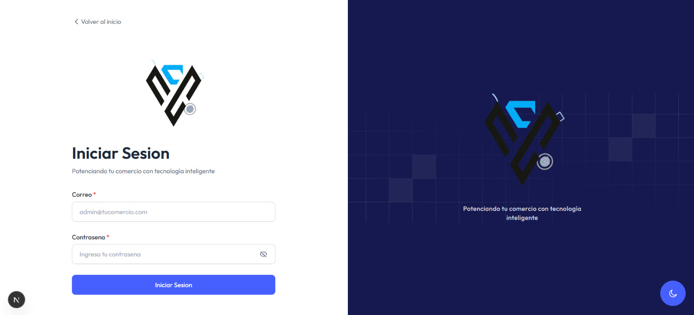
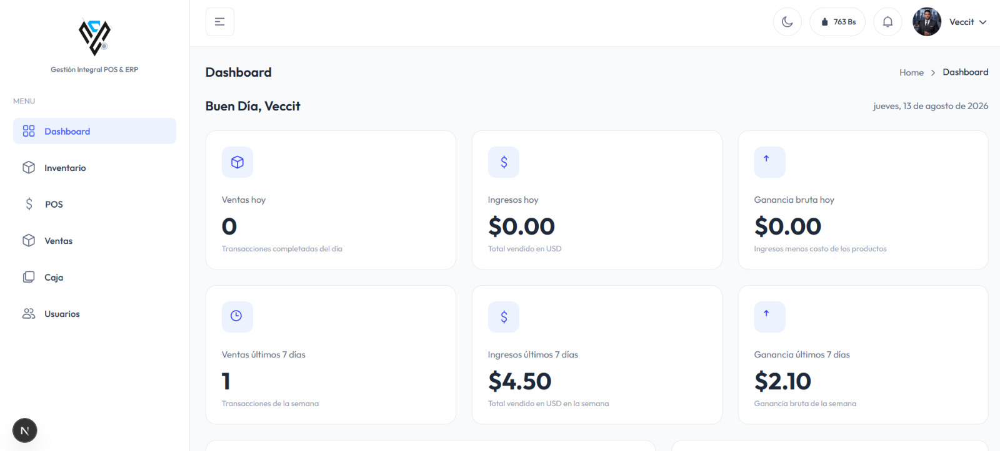
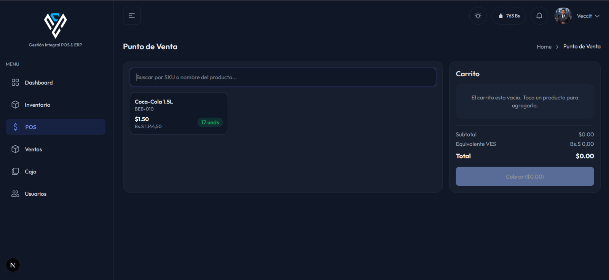
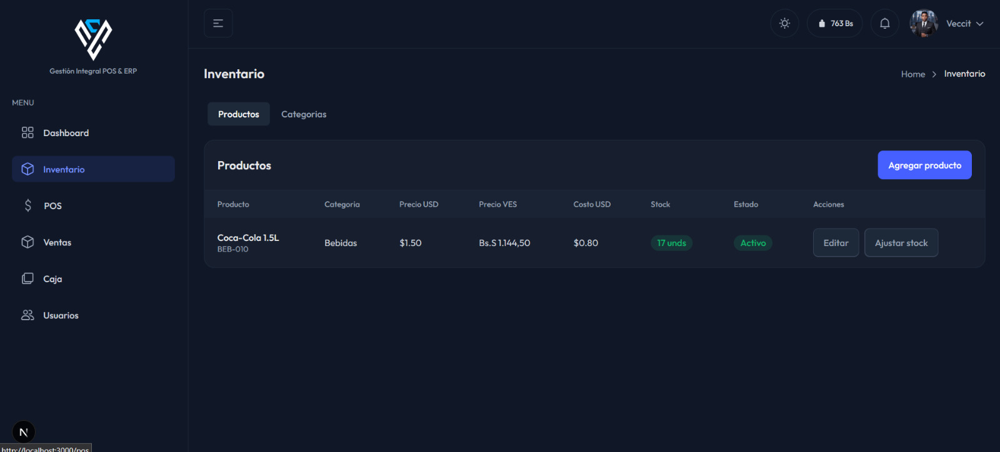
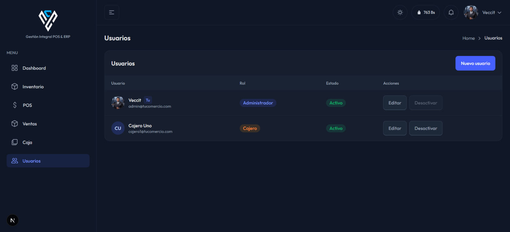
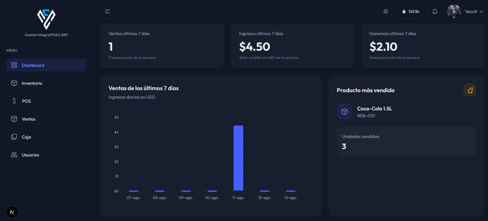

<div align="center">


# Veccit POS Engine

**Sistema Punto de Venta (POS) y Gestión de Inventario Multi-Tenant (SaaS)**

Diseñado para pequeños y medianos comercios de Venezuela: operación en **USD y VES** con conversión en tiempo real, aislamiento absoluto de datos por comercio y pagos mixtos en transacciones ACID.

[](https://nestjs.com)
[](https://nextjs.org)
[](https://www.typescriptlang.org)
[](https://www.postgresql.org)
[](https://typeorm.io)
[](https://tailwindcss.com)
[](https://www.docker.com)
[](LICENSE)


</div>

---

## 📖 Índice

- [Características](#-características)
- [Modelo SaaS y roles](#-modelo-saas-y-roles)
- [Capturas](#-capturas)
- [Stack tecnológico](#-stack-tecnológico)
- [Arquitectura](#-arquitectura)
- [Estructura del monorepo](#-estructura-del-monorepo)
- [Instalación](#-instalación)
- [Verificación y calidad](#-verificación-y-calidad)
- [Despliegue con Docker](#-despliegue-con-docker)
- [Documentación](#-documentación)
- [Licencia](#-licencia)

---

## ✨ Características

| Área | Funcionalidades |
| --- | --- |
| **Multi-Tenant SaaS** | Cada comercio tiene sus datos 100% aislados (`tenantId`). Aislamiento por repositorios **+ Row-Level Security (RLS)** en PostgreSQL como segunda línea de defensa. |
| **Multimoneda** | Contabilidad en **USD**; precios en **VES** calculados en tiempo real con la tasa del día. Pagos **mixtos/divididos** (efectivo USD + pago móvil VES + tarjeta) validados en una sola **transacción ACID**. |
| **POS** | Búsqueda rápida por SKU/nombre, carrito interactivo con totales duales USD/VES, cobro con pagos mixtos, historial de ventas y **recibo imprimible**. |
| **Inventario** | Productos con precio en USD, categorías, ajustes de stock (entradas/salidas) y **alertas de stock mínimo**. |
| **Caja (tesorería)** | Apertura/cierre de turno de cajero, arqueo y cuadre de caja, historial de turnos y **anulación de ventas con reposición de stock**. |
| **Dashboard** | Métricas del día (ventas, ganancia bruta USD), producto más vendido y gráfico de ventas de 7 días. Exclusivo del administrador. |
| **Gestión de usuarios** | Usuarios por comercio, roles `TENANT_ADMIN` / `CASHIER`, activar/desactivar y **avatares seguros por tenant**. |
| **Seguridad** | JWT en cookie `HttpOnly` (`SameSite=Strict`, `Secure`), guard de roles (RBAC), **CSRF** (validación de `Origin`/`Referer`), helmet, **rate limiting** y saneamiento DTO con `class-validator`. |
| **Plataforma SaaS** | Panel `SUPER_ADMIN` para registrar comercios, gestionar planes (`FREE`/`PRO`) y activar/desactivar operación. |

---

## 👥 Modelo SaaS y roles

```text
SUPER_ADMIN (dueño de la plataforma)
  └── Crea comercios (tenants) y gestiona sus planes desde /platform
        │
        └── TENANT_ADMIN (dueño del comercio)
              ├── Dashboard, inventario, tasas, usuarios y anulación de ventas
              ├── Crea cajeros (CASHIER) en su comercio
              │     └── CASHIER
              │           └── Solo POS y cierre de caja (sin costos ni ganancias)
```

- **`SUPER_ADMIN`** — solo ve el panel de comercios (`/platform`). No tiene tenant.
- **`TENANT_ADMIN`** — control total del negocio: dashboard, inventario, tasa, usuarios, anulaciones.
- **`CASHIER`** — acceso limitado al POS y cierre de caja; no ve costos ni ganancias.

---

## 📸 Capturas

| Inicio de sesión | Dashboard |
| --- | --- |
|  |  |

| POS (cobro) | Inventario |
| --- | --- |
|  |  |

| Usuarios | Dashboard — gráfico de ventas |
| --- | --- |
|  |  |

---

## 🏗️ Stack tecnológico

**Backend — `backend/`**

- **NestJS 10** + TypeScript estricto, organizado en **Clean Architecture** (dominio sin dependencias de frameworks).
- **PostgreSQL + TypeORM**: migraciones, transacciones ACID y **Row-Level Security**.
- **JWT** en cookie HttpOnly + **AsyncLocalStorage** para inyectar el `tenantId` en cada consulta.
- Swagger documentado en `/api/docs`.

**Frontend — `frontend/`**

- **Next.js 16 (App Router)** + React 19 + TypeScript estricto.
- **Tailwind CSS** con el template **TailAdmin** (UI Open Source).
- **Vitest** para tests de lógica pura (cálculos del carrito y pagos mixtos).

**Infraestructura**

- **Docker Compose**: servicios `db` (PostgreSQL 16) y `api` (backend en producción multi-stage).

---

## 🧬 Arquitectura

El backend sigue **Clean Architecture** (Robert C. Martin) en 4 capas, donde el **dominio es puro** (cero dependencias de NestJS/TypeORM):

```text
backend/src/
├── domain/          # Entidades, value objects (Money, SKU), excepciones y repositorios
├── application/     # Casos de uso (ProcessSaleUseCase, OpenShiftUseCase, ...) y DTOs
├── infrastructure/  # Repositorios TypeORM, migraciones, TenantContext, seguridad
└── presentation/    # Controladores HTTP, guards (JWT/Tenant/Roles) e interceptores
```

Detalle completo en [`docs/arquitectura_maestra.md`](docs/arquitectura_maestra.md).

---

## 🗂️ Estructura del monorepo

```text
veccit-pos-engine/
├── backend/                 # API NestJS (Clean Architecture + PostgreSQL)
├── frontend/                # UI Next.js (App Router + TailAdmin)
├── docs/                    # Documentación (arquitectura, plan de acción, manual)
├── docker-compose.yml       # Postgres + API para producción
├── LICENSE                  # MIT
└── AGENTS.md                # Reglas de trabajo para agentes/IA
```

---

## 🚀 Instalación

### Requisitos previos

- **Node.js 20+** y npm
- **Docker** (para PostgreSQL) o PostgreSQL local en el puerto `5433`

### 1. Base de datos

```bash
docker compose up -d db
```

| Variable | Valor por defecto |
| --- | --- |
| Base de datos | `veccit_pos` |
| Usuario / contraseña | `postgres` / `postgres` |
| Puerto expuesto | `5433` |

### 2. Backend (API)

```bash
cd backend
npm install
cp .env.example .env      # ajusta JWT_SECRET y las credenciales del SUPER_ADMIN
npm run migration:run     # aplica las migraciones (usuarios, tasas, inventario, ventas, caja)
npm run start:dev         # desarrollo con watch (corre las migraciones pendientes al arrancar)
```

- API base: `http://localhost:3001/api`
- **Swagger**: `http://localhost:3001/api/docs`
- Al iniciar por primera vez se crea automáticamente el **`SUPER_ADMIN`** con las credenciales de `SUPER_ADMIN_EMAIL` / `SUPER_ADMIN_PASSWORD` del `.env`.

### 3. Frontend (UI)

```bash
cd frontend
npm install
cp .env.example .env.local   # NEXT_PUBLIC_API_URL=http://localhost:3001/api
npm run dev
```

- Aplicación web: `http://localhost:3000`

### 4. Primer uso

1. Inicia sesión como `SUPER_ADMIN` en `http://localhost:3000/signin`.
2. Ve a **Comercios** (`/platform`) → **"Nuevo comercio"** → se crea el tenant y su usuario `TENANT_ADMIN`.
3. Entrega esas credenciales al cliente: podrá gestionar su inventario, POS, ventas y usuarios.

Guía completa en [`docs/manual_de_usuario.md`](docs/manual_de_usuario.md).

---

## ✅ Verificación y calidad

**Backend** (dentro de `backend/`):

```bash
npm run lint          # ESLint
npx tsc --noEmit      # typecheck estricto
npm test              # tests unitarios (Jest, 156+)
npm run test:e2e      # e2e contra PostgreSQL real (requiere veccit_pos_test)
```

**Frontend** (dentro de `frontend/`):

```bash
npm run lint          # ESLint
npx tsc --noEmit      # typecheck estricto
npm test              # tests unitarios (Vitest)
npm run build         # build de producción
```

---

## 🐳 Despliegue con Docker

```bash
cp .env.production.example .env.production   # completa JWT_SECRET, DB_PASSWORD, SUPER_ADMIN_PASSWORD, CORS_ORIGIN, SESSION_SECURE
docker compose up --build
```

Levanta la **API** (`veccit_pos_api`, puerto `3001`) y la **BD** (`veccit_pos_db`, puerto `5433`). En producción ejecuta las migraciones manualmente:

```bash
docker compose exec api npm run migration:run
```

---

## 📚 Documentación

| Documento | Descripción |
| --- | --- |
| [`docs/arquitectura_maestra.md`](docs/arquitectura_maestra.md) | Arquitectura completa, estrategia multi-tenant y reglas de negocio |
| [`docs/manual_de_usuario.md`](docs/manual_de_usuario.md) | Guía de uso del sistema y todas sus funcionalidades |
| [`docs/plan_de_accion.md`](docs/plan_de_accion.md) | Roadmap de desarrollo por fases |
| [`backend/README.md`](backend/README.md) | Instalación y comandos del backend |
| [`frontend/README.md`](frontend/README.md) | Instalación y comandos del frontend |

---

## 📄 Licencia

Distribuido bajo la licencia **MIT**. Ver [LICENSE](LICENSE).
